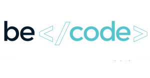

# Becode-First-Part

## Qu'est ce que c'est :
Ici vous trouverez tous mes projets réalisé pendant la premiere partie de ma formation chez Becode.

## Qui y a t il dedans :

1. [404](https://github.com/Delvaux1986/Becode-First-Part/tree/master/404)
2. [Bootstrap training](https://github.com/Delvaux1986/Becode-First-Part/tree/master/Bootstrap%20Train)
3. [Challenge Responsive](https://github.com/Delvaux1986/Becode-First-Part/tree/master/Challenge%20Responsive)
4. [Delvaux1986.github.io](https://github.com/Delvaux1986/Becode-First-Part/tree/master/Delvaux1986.github.io)
5. [Exo HTML basic](https://github.com/Delvaux1986/Becode-First-Part/tree/master/Exo%20Html%20Basic)
5. [Exo Markdown](https://github.com/Delvaux1986/Becode-First-Part/tree/master/Exo%20MarkDown)
6. [Learning environment](https://github.com/Delvaux1986/Becode-First-Part/tree/master/Learning%20Environment)
7. [Learning Responsive](https://github.com/Delvaux1986/Becode-First-Part/tree/master/Learning%20Responsive)
8. [Star Wars Crawl](https://github.com/Delvaux1986/Becode-First-Part/tree/master/Star%20Wars%20Crawl)
9. [Projet Tim Berners lee](https://github.com/Delvaux1986/Becode-First-Part/tree/master/Tim%20Berners%20Lee)
10. [Learning SASS](https://github.com/Delvaux1986/Becode-First-Part/tree/master/Turlututu.io)
11. [Animation Css](https://github.com/Delvaux1986/Becode-First-Part/tree/master/animation%20CSS)
12. [Learning HTML & CSS](https://github.com/Delvaux1986/Becode-First-Part/tree/master/progressive%20enhancement)

## Quand ai-je travaillé dessus :

Nous avons commencer le 2 juin 2020 et fini le 2 juillet 2020 me semble t il .

## Qui suis-je :

Je m'apelle Robby Delvaux et je suis apprenant a Becode Promo Woods3.21 
[Github](https://github.com/Delvaux1986)

