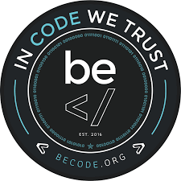

# Tim Berners-lee project.

#### Objectif :

L'objectif est de recopier une page qu'on a recu sur Tim Berners-lee inventeur du world wide web.

#### Quand ai-je travaillé dessus :

J'ai travaillé dessus le mardi 16 juin 2020 et je pense l'avoir terminé .

#### Qui suis-je :

Bonjour , je m'apelle [Robby Delvaux](https://github.com/Delvaux1986) j'ai 34 ans et je suis apprenant a Becode .

#### Ou j'en suis :

La j'ai terminé je penses .

#### Les technologies utilisées :

1. MarkDown (readme)
2. HTML 
3. CSS (style)

#### Quels genre de probleme j'ai rencontré :

* Surtout des problemes pour aligner tous correctement . 
    * J'ai reglé cela en chipotant un peu avec les proprietés CSS.
* Et aussi un petit probleme sur la taille des icones.
    * J'ai trouvé en cherchant qu'on pouvait modifier la taille directement dans la 
        balise .

#### Projet fini :

[Tim Berners-lee ProJecT](https://delvaux1986.github.io/tim-berners-lee/)

#### Le mots de la fin :

**FLEX BOX**

