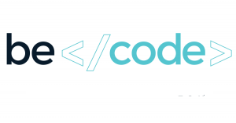

### Sass Convert 

# Objectifs :

**Conversion du fichier Css en Scss .**

[Liste des choses a faire](https://github.com/becodeorg/CRL-Woods-3.21/tree/master/LearningPath/01-Prairie/06.Sass)

1. Crée une arborescence avec Assets et different dossier
2. Il fallait convertir tous le Css en Scss
    * Crée une @maxin
    * création de Variables
    * Imbrications
    * Utilise des formules mathematiques tel que  ( width: (100/3)*1% ; )

### Qu'est ce que c'est :

Conversion du style.css en scss et ajout d'une librairie

### Quand ai-je travaillé dessus :

Samedi 20/06/2020 en apres midi 

### Ou j'en suis dans le projet :

J'ai normalement terminer . :D 

### Qui suis-je :

Je m'apelle [Robby Delvaux](https://github.com/Delvaux1986) . apprenant a Becode.org

