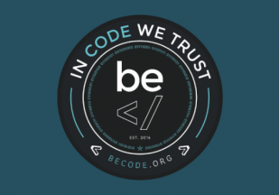

### progressive-enhancement

# Objectifs :

**Apprentissage et mise en pratique HTML5 et CSS3 .**

[Liste des choses a faire](https://github.com/becodeorg/CRL-Woods-3.21/tree/master/LearningPath/01-Prairie/05.HTML-CSS/progressive-enhancement)

1. La sémantique 
* Les attribus HTML
2. Le CSS : controler le rendu visuel
    * Les selecteurs en CSS part 1
    * Le bloc en CSS 
    * Les selecteurs en CSS part 2 
* Concept 3: Le positionnement en CSS
3. Web Fonts
4. Outils utiles
5. Exercices pratiquent

### Qu'est ce que c'est :

Apprentissage en HTML et CSS .

### Quand ai-je travaillé dessus :

Dès que j'ai du temps libre 

### Ou j'en suis dans le projet :

Je dois en être a 50-60% plus ou moins .

### Qui suis-je :

Je m'apelle [Robby Delvaux](https://github.com/Delvaux1986) .

